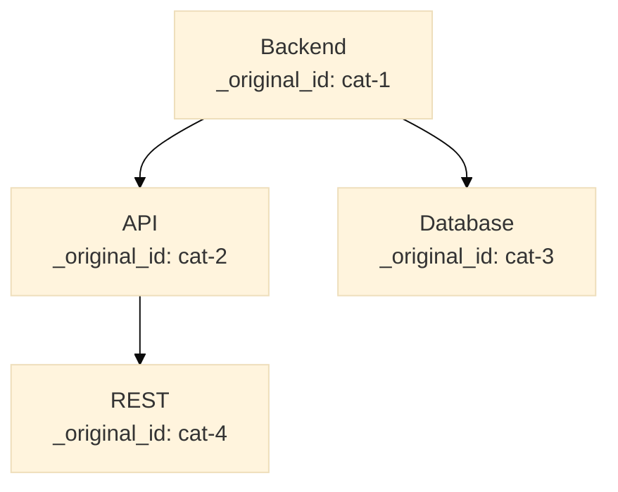

# Basic I/O Service


A microservice for handling data import and export operations across the Waterfall platform.  
This service enables seamless data migration to and from Waterfall by providing standardized import/export endpoints with detailed error reporting and ID mapping.

---

## Overview

The Basic I/O Service is designed to facilitate bulk data operations in the Waterfall ecosystem with **intelligent reference resolution and tree structure support**:

- **Export data** from any Waterfall service endpoint to CSV, JSON, or Mermaid format
- **Enriched exports** with automatic foreign key metadata extraction
- **Tree structure intelligence** - auto-detect and handle hierarchical data (parent_id fields)
- **Import data** from CSV, JSON, or Mermaid files to any Waterfall service endpoint
- **Automatic reference resolution** - no need to import in specific order!
- **Mermaid diagram support** - visual export/import for documentation and exploration
- **Track UUID mappings** between original and newly created records
- **Detailed reporting** with success/failure rates and reference resolution details
- **Batch processing** with graceful error handling

### Key Innovation: No Import Order Required! 🚀

Unlike traditional import/export tools, this service uses **enriched exports** to automatically resolve foreign key references:

1. **Export with enrichment**: The service detects UUID foreign keys and fetches referenced resource details
2. **Import intelligently**: References are automatically resolved using lookup fields (email, name, etc.)
3. **No dependencies**: Import tasks before projects, or projects before users - it just works!
4. **Tree structures**: Automatically handles parent_id fields with topological sorting

### Tree Structure Support 🌳

The service automatically detects hierarchical data (parent_id fields) and provides special handling:

- **CSV**: Always exports flat, but preserves parent_id for import ordering
- **JSON**: Can export as flat list or nested tree structure (tree=true)
- **Mermaid**: Always exports as visual hierarchical diagram (flowchart, graph, or mindmap)
- **Import**: Automatically sorts to ensure parents are imported before children
- **Cycle detection**: Prevents circular references in tree structures

### Mermaid Format Support 🎨

Export and import data as Mermaid diagrams:

- Visual documentation in GitHub, GitLab, VS Code, and other Markdown viewers
- Interactive data exploration with clickable nodes
- Diagram-driven data creation (draw first, import later)
- Perfect for category hierarchies, organizational charts, and taxonomies

### Use Cases

- Migrate user tables, roles, projects, tasks **in any order**
- Export/import category hierarchies and organizational structures
- Backup and restore data across Waterfall instances
- Visual data exploration and documentation with Mermaid
- Bulk data operations with comprehensive audit trails
- Initial data seeding for new environments
- Cross-environment data synchronization

---

## Features

- **Multiple Format Support**: JSON, CSV, and Mermaid (extensible for future formats)
- **Tree Structure Detection**: Automatically detects and handles parent_id fields
- **Enriched Exports**: Automatic extraction of foreign key reference metadata
- **Intelligent Import**: Automatic resolution of FK references using lookup fields
- **UUID Mapping**: Automatic tracking of original UUIDs to new UUIDs during import
- **No Import Order**: Import in any order when using enriched exports
- **Topological Sorting**: Ensures parents are imported before children in tree structures
- **Cycle Detection**: Prevents circular parent_id references
- **Ambiguity Detection**: Clear reporting when references have multiple matches
- **Mermaid Diagrams**: Visual export/import with flowchart, graph, or mindmap syntax
- **Error Resilience**: Partial imports with detailed error reporting
- **Authentication**: JWT-based authentication with access control
- **Transparent Proxying**: Forwards authentication to target services
- **Detailed Reports**: Success/failure counts, reference resolution stats, error messages, and timing
- **No Size Limits**: Handles large datasets efficiently
- **Docker-Ready**: Containerized deployment with health checks

---

## API Endpoints

### Import/Export Operations

| Method | Path     | Description                                    |
|--------|----------|------------------------------------------------|
| GET    | /export  | Export data from a Waterfall service to file  |
| POST   | /import  | Import data from file to a Waterfall service  |

### System Endpoints

| Method | Path      | Description                       |
|--------|-----------|-----------------------------------|
| GET    | /health   | Health check endpoint             |
| GET    | /version  | Get API version                   |
| GET    | /config   | Get current app configuration     |

See [`openapi.yml`](openapi.yml) for full API documentation.

## API Parameters

### Export Parameters

| Parameter      | Type    | Required | Default    | Description |
|---------------|---------|----------|------------|-------------|
| `url`         | string  | Yes      | -          | Target Waterfall service endpoint URL to export data from |
| `type`        | string  | No       | `json`     | Export format: `json`, `csv`, or `mermaid` |
| `enrich`      | boolean | No       | `true`     | Add reference metadata for intelligent import (JSON only). Detects foreign keys and adds `_references` with lookup information |
| `tree`        | boolean | No       | `false`    | Convert flat list to nested tree structure (JSON only). Only applies when data has a `parent_id` field |
| `diagram_type`| string  | No       | `flowchart`| Type of Mermaid diagram: `flowchart`, `graph`, or `mindmap` (Mermaid only) |
| `lookup_config`| string | No       | -          | JSON string defining custom lookup fields for specific resource types. Format: `{"users": ["email"], "projects": ["name"]}` |

### Import Parameters

| Parameter              | Type    | Required | Default | Description |
|-----------------------|---------|----------|---------|-------------|
| `url`                 | string  | Yes      | -       | Target Waterfall service endpoint URL to import data to |
| `type`                | string  | No       | `json`  | Import format: `json`, `csv`, or `mermaid` |
| `on_ambiguous`        | string  | No       | `skip`  | Behavior when FK reference has multiple matches: `skip` (set FK to null and continue) or `fail` (abort entire import with 400 error) |
| `on_missing`          | string  | No       | `skip`  | Behavior when FK reference has no matches: `skip` (set FK to null and continue) or `fail` (abort entire import with 400 error) |
| `detect_cycles`       | boolean | No       | `true`  | Detect and prevent circular parent_id references in tree structures |
| `lookup_config`       | string  | No       | -       | JSON string defining custom lookup fields for reference resolution. Format: `{"users": ["email"], "projects": ["name"]}` |

**Note:** The `enrich` parameter is highly recommended when exporting data that will be imported, as it enables automatic foreign key resolution during import.

---

## Quick Start

### Export Example

Export categories with enriched reference metadata and tree structure:

```bash
curl -X GET "http://localhost:5000/export?url=http://localhost:5001/api/categories&type=json&enrich=true&tree=true" \
  --cookie "access_token=YOUR_JWT_TOKEN" \
  -o categories_tree.json
```

Export as Mermaid flowchart diagram:

```bash
curl -X GET "http://localhost:5000/export?url=http://localhost:5001/api/categories&type=mermaid&diagram_type=flowchart" \
  --cookie "access_token=YOUR_JWT_TOKEN" \
  -o categories.mmd
```

Export as Mermaid mindmap:

```bash
curl -X GET "http://localhost:5000/export?url=http://localhost:5001/api/categories&type=mermaid&diagram_type=mindmap" \
  --cookie "access_token=YOUR_JWT_TOKEN" \
  -o categories_mindmap.mmd
```

Export tasks with enriched metadata (flat JSON):

```bash
curl -X GET "http://localhost:5000/export?url=http://localhost:5001/api/tasks&type=json&enrich=true" \
  --cookie "access_token=YOUR_JWT_TOKEN" \
  -o tasks_export.json
```

Export users as CSV (no enrichment for CSV):

```bash
curl -X GET "http://localhost:5000/export?url=http://localhost:5001/api/users&type=csv" \
  --cookie "access_token=YOUR_JWT_TOKEN" \
  -o users_export.csv
```

### Import Example

Import categories from enriched JSON tree (automatic reference resolution and parent ordering):

```bash
curl -X POST "http://localhost:5000/import?url=http://localhost:5001/api/categories&type=json" \
  --cookie "access_token=YOUR_JWT_TOKEN" \
  -F "file=@categories_tree.json"
```

Import from Mermaid diagram:

```bash
curl -X POST "http://localhost:5000/import?url=http://localhost:5001/api/categories&type=mermaid" \
  --cookie "access_token=YOUR_JWT_TOKEN" \
  -F "file=@categories.mmd"
```

Import tasks from enriched JSON (automatic reference resolution):

```bash
curl -X POST "http://localhost:5000/import?url=http://localhost:5001/api/tasks&type=json" \
  --cookie "access_token=YOUR_JWT_TOKEN" \
  -F "file=@tasks_export.json"
```

Import users from CSV file:

```bash
curl -X POST "http://localhost:5000/import?url=http://localhost:5001/api/users&type=csv" \
  --cookie "access_token=YOUR_JWT_TOKEN" \
  -F "file=@users_import.csv"
```

Import with fail-fast mode (abort on ambiguous or missing references):

```bash
curl -X POST "http://localhost:5000/import?url=http://localhost:5001/api/tasks&type=json&on_ambiguous=fail&on_missing=fail" \
  --cookie "access_token=YOUR_JWT_TOKEN" \
  -F "file=@tasks_export.json"
```

Import with lenient mode (skip problematic records, set FK to null):

```bash
curl -X POST "http://localhost:5000/import?url=http://localhost:5001/api/tasks&type=json&on_ambiguous=skip&on_missing=skip" \
  --cookie "access_token=YOUR_JWT_TOKEN" \
  -F "file=@tasks_export.json"
```

Import with cycle detection disabled (use with caution):

```bash
curl -X POST "http://localhost:5000/import?url=http://localhost:5001/api/categories&type=json&detect_cycles=false" \
  --cookie "access_token=YOUR_JWT_TOKEN" \
  -F "file=@categories.json"
```

### Import Response Example

```json
{
  "total_records": 100,
  "successful_imports": 95,
  "failed_imports": 5,
  "auto_resolved_references": 180,
  "ambiguous_references": 3,
  "missing_references": 2,
  "id_mapping": {
    "a1b2c3d4-e5f6-4a5b-8c9d-0e1f2a3b4c5d": "new-uuid-1",
    "b2c3d4e5-f6a7-4b5c-9d0e-1f2a3b4c5d6e": "new-uuid-2",
    "c3d4e5f6-a7b8-4c5d-0e1f-2a3b4c5d6e7f": "new-uuid-3"
  },
  "reference_resolutions": [
    {
      "record_index": 12,
      "record_name": "Implement feature X",
      "resolutions": [
        {
          "field": "assigned_to",
          "status": "ambiguous",
          "lookup_attempted": "email=john@example.com",
          "candidates": [
            {
              "id": "uuid-1",
              "email": "john@example.com",
              "name": "John Doe (Admin)",
              "company": "Company A"
            },
            {
              "id": "uuid-2",
              "email": "john@example.com",
              "name": "John Doe (Developer)",
              "company": "Company B"
            }
          ]
        }
      ]
    }
  ],
  "errors": [
    {
      "record_index": 12,
      "original_id": "task-uuid-13",
      "error_message": "Skipped due to ambiguous reference: assigned_to",
      "http_status": null
    }
  ],
  "warnings": [
    {
      "record_index": 5,
      "message": "Field '_original_id' was removed before posting"
    }
  ],
  "duration_seconds": 8.23
}
```

---

## How It Works

### Export Process

1. Receives export request with target URL, format, enrichment flag, and tree options
2. Authenticates with target service using forwarded JWT cookie
3. Fetches all data from target endpoint (GET request)
4. **Detects data structure**: Checks for presence of `parent_id` or `parent_uuid` field
5. Adds `_original_id` field to preserve original record UUIDs
6. **If `enrich=true` (JSON only)**:
   - Detects UUID foreign key fields (fields ending with `_id` or `_uuid`)
   - Special handling for `parent_id`: treated as internal FK within same resource
   - For each FK, fetches the referenced resource
   - Extracts identifying fields (email, name, slug, etc.) based on resource type
   - Builds `_references` metadata object with lookup information
7. **Format-specific processing**:
   - **CSV**: Always flat list (parent_id preserved as column)
   - **JSON + tree=false**: Flat list (parent_id as field)
   - **JSON + tree=true**: Nested structure with `children` arrays
   - **Mermaid**: Hierarchical diagram (flowchart, graph, or mindmap)
8. Returns downloadable file with appropriate Content-Disposition header

**Example Flat Export (CSV or JSON)**:
```json
[
  {"_original_id": "cat-1", "name": "Backend", "parent_id": null},
  {"_original_id": "cat-2", "name": "API", "parent_id": "cat-1"},
  {"_original_id": "cat-3", "name": "Database", "parent_id": "cat-1"},
  {"_original_id": "cat-4", "name": "REST", "parent_id": "cat-2"}
]
```

**Example Tree Export (JSON with tree=true)**:
```json
[
  {
    "_original_id": "cat-1",
    "name": "Backend",
    "parent_id": null,
    "children": [
      {
        "_original_id": "cat-2",
        "name": "API",
        "parent_id": "cat-1",
        "children": [
          {
            "_original_id": "cat-4",
            "name": "REST",
            "parent_id": "cat-2",
            "children": []
          }
        ]
      },
      {
        "_original_id": "cat-3",
        "name": "Database",
        "parent_id": "cat-1",
        "children": []
      }
    ]
  }
]
```

**Example Mermaid Export**:


**Example Enriched Export with parent_id**:
```json
[
  {
    "_original_id": "cat-2",
    "name": "API",
    "parent_id": "cat-1",
    "_references": {
      "parent_id": {
        "resource_type": "categories",
        "original_id": "cat-1",
        "lookup_field": "name",
        "lookup_value": "Backend"
      }
    }
  }
]
```

### Import Process

1. Receives import request with file, target URL, and configuration
2. Parses uploaded file (CSV, JSON, or Mermaid)
3. **Tree Structure Detection and Preparation**:
   - Detects if data has `parent_id` field
   - If JSON tree format (with `children`): flattens to list
   - If Mermaid: parses diagram and reconstructs parent_id relationships
   - Performs topological sort to ensure parents imported before children
   - Detects circular references if `detect_cycles=true`
4. For each record (in dependency order for trees):
   
   **A. Intelligent Reference Resolution** (if `_references` present):
   - For each foreign key field (including `parent_id`):
     * **parent_id special handling**: First checks current import session mapping
     * **Other FKs**: Extracts lookup field and value from `_references`
     * Queries target service: `GET /api/{resource_type}?{lookup_field}={lookup_value}`
     * **Exactly 1 match** → Auto-resolves FK to new UUID ✅
     * **0 matches** → Marks as "missing reference" ⚠️
     * **>1 matches** → Marks as "ambiguous reference" (reports candidates) ⚠️
   
   **B. Record Cleanup**:
   - Removes `_original_id` field (target will assign new UUID)
   - Removes `_references` metadata
   - Removes `children` field (if present from tree format)
   - Replaces all resolved FKs with new UUIDs
   
   **C. Import to Target**:
   - Makes synchronous POST request to target URL with JWT authentication
   - Captures new UUID from target service response
   - Maps original UUID → new UUID (stored for parent_id resolution in same session)
   - Handles errors gracefully (skips failed records based on config)

5. Returns detailed report with:
   - Total/successful/failed counts
   - Auto-resolved/ambiguous/missing reference counts
   - UUID mapping for all successful imports
   - Detailed resolution info for ambiguous/missing references
   - Cycle detection results (if applicable)
   - Processing duration

### Tree Import Logic

```
For tree structure with parent_id:

Step 1: Topological Sort
  [cat-1 (no parent), cat-2 (parent: cat-1), cat-3 (parent: cat-1), cat-4 (parent: cat-2)]
  Sorted order: [cat-1, cat-2, cat-3, cat-4]

Step 2: Import with Session Mapping
  Import cat-1 → new UUID: new-cat-1
  session_mapping["cat-1"] = "new-cat-1"
  
  Import cat-2 with parent_id:
    Original parent_id: "cat-1"
    Resolved parent_id: "new-cat-1" (from session_mapping)
  → new UUID: new-cat-2
  session_mapping["cat-2"] = "new-cat-2"
  
  Import cat-3 with parent_id:
    Original parent_id: "cat-1"
    Resolved parent_id: "new-cat-1" (from session_mapping)
  → new UUID: new-cat-3
  
  Import cat-4 with parent_id:
    Original parent_id: "cat-2"
    Resolved parent_id: "new-cat-2" (from session_mapping)
  → new UUID: new-cat-4

Result: Complete tree structure reconstructed with new UUIDs ✅
```

### Mermaid Import Logic

```
Input Mermaid:
  flowchart TD
      backend["Backend"] --> api["API"]
      backend --> database["Database"]

Parsed Structure:
  Nodes: {backend: "Backend", api: "API", database: "Database"}
  Edges: [(backend → api), (backend → database)]

Reconstructed Records:
  [
    {name: "Backend", parent_id: null},
    {name: "API", parent_id: "backend_ref"},
    {name: "Database", parent_id: "backend_ref"}
  ]

Then imported using standard tree import logic.
```

### Reference Resolution Logic

```
For FK field "assigned_to" with reference metadata:
  resource_type: "users"
  lookup_field: "email"
  lookup_value: "john@example.com"

Query: GET /api/users?email=john@example.com

Results:
  • 1 match  → assigned_to = matched_user_uuid ✅
  • 0 match  → Skip record or error (configurable) ⚠️
  • 2+ match → Skip record + report candidates ⚠️
```

---

## Important Considerations

### No Import Order Required! 🎉

When using enriched exports (`enrich=true`), you can import in **any order**:

```bash
# Import in any order - references are resolved automatically!
curl -X POST "http://localhost:5000/import?url=http://target/api/tasks" \
  --cookie "..." -F "file=@tasks.json"

curl -X POST "http://localhost:5000/import?url=http://target/api/projects" \
  --cookie "..." -F "file=@projects.json"

curl -X POST "http://localhost:5000/import?url=http://target/api/users" \
  --cookie "..." -F "file=@users.json"
```

The service will:
- Query the target system for each reference using lookup fields
- Automatically resolve FKs to the correct new UUIDs
- Report any ambiguous or missing references clearly

### UUID Identification

**All IDs in Waterfall are UUIDs**. The service:
- Preserves original UUIDs in `_original_id` during export
- Automatically detects FK fields (ending with `_id` or `_uuid`)
- Maps original UUIDs to new UUIDs during import
- Returns complete UUID mappings in import reports

### Foreign Key Resolution Strategies

#### **Automatic Resolution** (Recommended)
Use enriched exports with reference metadata:

```json
{
  "_original_id": "task-uuid",
  "assigned_to": "user-uuid",
  "_references": {
    "assigned_to": {
      "resource_type": "users",
      "lookup_field": "email",
      "lookup_value": "john@example.com"
    }
  }
}
```

The service queries: `GET /api/users?email=john@example.com` and resolves automatically.

#### **Ambiguous References**
When multiple matches are found, the import report includes candidates:

```json
{
  "reference_resolutions": [
    {
      "record_index": 12,
      "resolutions": [{
        "field": "assigned_to",
        "status": "ambiguous",
        "candidates": [
          {"id": "uuid-1", "email": "john@example.com", "name": "John Doe (Admin)"},
          {"id": "uuid-2", "email": "john@example.com", "name": "John Doe (Developer)"}
        ]
      }]
    }
  ]
}
```

**Solution**: Export with additional context fields or manually update the data before re-import.

#### **Missing References**
When no match is found:

```json
{
  "resolutions": [{
    "field": "project_id",
    "status": "missing",
    "error_message": "No project found with name 'Old Project'"
  }]
}
```

**Solution**: Import the referenced resource first, or remove the FK from the data.

### Lookup Field Configuration

**Default conventions**:
- `users` → lookup by `email`
- `projects` → lookup by `name`
- `roles` → lookup by `name`
- Most resources → lookup by `name`

**Custom configuration**:
```bash
curl -X GET "http://localhost:5000/export?url=...&enrich=true&lookup_config={\"users\":[\"email\"],\"projects\":[\"name\",\"company_id\"]}"
```

### Example Migration Workflow

```bash
# Step 1: Export with enrichment (all at once, any order)
curl -X GET "http://source:5001/api/users?enrich=true" --cookie "..." -o users.json
curl -X GET "http://source:5001/api/projects?enrich=true" --cookie "..." -o projects.json
curl -X GET "http://source:5001/api/tasks?enrich=true" --cookie "..." -o tasks.json

# For tree structures
curl -X GET "http://source:5001/api/categories?enrich=true&tree=true" --cookie "..." -o categories.json

# Step 2: Import in ANY order (references auto-resolved!)
curl -X POST "http://localhost:5000/import?url=http://target:5001/api/tasks" \
  --cookie "..." -F "file=@tasks.json" > tasks_report.json

curl -X POST "http://localhost:5000/import?url=http://target:5001/api/categories" \
  --cookie "..." -F "file=@categories.json" > categories_report.json

curl -X POST "http://localhost:5000/import?url=http://target:5001/api/projects" \
  --cookie "..." -F "file=@projects.json" > projects_report.json

curl -X POST "http://localhost:5000/import?url=http://target:5001/api/users" \
  --cookie "..." -F "file=@users.json" > users_report.json

# Step 3: Review reports for any ambiguous/missing references
cat tasks_report.json | jq '.reference_resolutions'
cat categories_report.json | jq '.id_mapping'
```

### Tree Structure Workflows

#### **Workflow 1: JSON Tree Export/Import**

```bash
# Export as nested tree structure
curl -X GET "http://source/api/categories?type=json&tree=true&enrich=true" \
  --cookie "..." -o categories_tree.json

# categories_tree.json:
# [
#   {
#     "name": "Backend",
#     "children": [
#       {"name": "API", "children": [...]},
#       {"name": "Database", "children": []}
#     ]
#   }
# ]

# Import (automatically flattened and sorted)
curl -X POST "http://target/api/categories?type=json" \
  --cookie "..." -F "file=@categories_tree.json"
```

#### **Workflow 2: Mermaid Diagram Export/Import**

```bash
# Export as Mermaid flowchart
curl -X GET "http://source/api/categories?type=mermaid&diagram_type=flowchart" \
  --cookie "..." -o categories.mmd

# View in GitHub, GitLab, or VS Code
# Edit visually if needed

# Import from Mermaid
curl -X POST "http://target/api/categories?type=mermaid" \
  --cookie "..." -F "file=@categories.mmd"
```

#### **Workflow 3: CSV Flat Export/Import (Tree Preserved)**

```bash
# Export as CSV (flat, but parent_id column preserved)
curl -X GET "http://source/api/categories?type=csv" \
  --cookie "..." -o categories.csv

# categories.csv:
# _original_id,name,parent_id,status
# cat-1,Backend,,active
# cat-2,API,cat-1,active
# cat-3,Database,cat-1,active

# Import (automatically sorted by parent dependency)
curl -X POST "http://target/api/categories?type=csv" \
  --cookie "..." -F "file=@categories.csv"
```

#### **Workflow 4: Documentation with Mermaid**

```bash
# Export as Mermaid mindmap for documentation
curl -X GET "http://source/api/categories?type=mermaid&diagram_type=mindmap" \
  --cookie "..." -o docs/categories_structure.mmd

# Add to README.md:
# ```mermaid
# (paste content of categories_structure.mmd)
# ```

# GitHub/GitLab will render it automatically!
```

### Error Handling

- **Target Unreachable**: Returns 502 error immediately
- **Authentication Failures**: Returns detailed error from target service
- **Parsing Errors**: Returns 400 with specific line/column information
- **Partial Import Failures**: Successful records are processed, failures logged in report
- **Ambiguous References**: 
  - `on_ambiguous=skip` (default): Set FK to null, continue import, report in `reference_resolutions`
  - `on_ambiguous=fail`: Abort entire import with 400 error on first ambiguous reference
- **Missing References**: 
  - `on_missing=skip` (default): Set FK to null, continue import, report with suggestions
  - `on_missing=fail`: Abort entire import with 400 error on first missing reference
- **No Timeouts**: Service handles large datasets without timeout restrictions

**Configuration Examples**:

```bash
# Lenient mode (default): Skip problematic records, set FK to null
curl -X POST "http://localhost:5000/import?url=...&on_ambiguous=skip&on_missing=skip" ...

# Strict mode: Fail fast on any reference issue
curl -X POST "http://localhost:5000/import?url=...&on_ambiguous=fail&on_missing=fail" ...

# Mixed mode: Skip ambiguous but fail on missing
curl -X POST "http://localhost:5000/import?url=...&on_ambiguous=skip&on_missing=fail" ...
```

---

## Configuration

The service is configured via environment variables. See `env.example` for a template.

### Key Environment Variables

| Variable                  | Description                          | Default      |
|---------------------------|--------------------------------------|--------------|
| `FLASK_ENV`               | Environment (development/production) | development  |
| `PORT`                    | Service port                         | 5000         |
| `JWT_SECRET`              | Secret key for JWT validation        | (required)   |
| `GUARDIAN_SERVICE_URL`    | URL of Guardian access control       | (required)   |
| `DATABASE_URL`            | Database connection string           | (optional)   |

---

## Development

### Local Setup

1. **Clone and install dependencies**:
   ```bash
   cd /path/to/basic_io_service
   pip install -r requirements-dev.txt
   ```

2. **Configure environment**:
   ```bash
   cp env.example .env.development
   # Edit .env.development with your settings
   ```

3. **Run database migrations** (if needed):
   ```bash
   flask db upgrade
   ```

4. **Start the service**:
   ```bash
   FLASK_ENV=development python run.py
   ```

### Docker

Build and run with Docker:

```bash
docker build -t basic-io-service .
docker run --env-file .env.development -p 5000:5000 basic-io-service
```

### Testing

Run the test suite:

```bash
pytest
```

With coverage:

```bash
pytest --cov=app --cov-report=html
```

---

## Project Structure

```
.
├── app/
│   ├── __init__.py          # Flask app factory
│   ├── config.py            # Environment-based configuration
│   ├── logger.py            # Logging setup
│   ├── routes.py            # Route registration
│   ├── utils.py             # JWT auth & access control decorators
│   ├── models/              # Database models (if needed)
│   ├── resources/           # API resource handlers
│   │   ├── export_data.py   # Export endpoint logic
│   │   ├── import_data.py   # Import endpoint logic
│   │   ├── health.py        # Health check endpoint
│   │   ├── version.py       # Version endpoint
│   │   └── config.py        # Config endpoint
│   └── schemas/             # Marshmallow schemas (if needed)
├── migrations/              # Database migrations
├── tests/                   # Test suite
├── openapi.yml              # OpenAPI 3.0 specification
├── requirements.txt         # Production dependencies
├── requirements-dev.txt     # Development dependencies
├── run.py                   # Application entry point
├── wsgi.py                  # WSGI entry point
├── Dockerfile               # Container configuration
└── README.md                # This file
```

---

## Security

- **JWT Authentication**: All endpoints require valid JWT tokens in HTTP-only cookies
- **Access Control**: Integration with Guardian service for permission checks
- **Internal Use Only**: Service is designed for internal Waterfall service communication
- **Token Forwarding**: JWT tokens are transparently forwarded to target services
- **No URL Validation**: Service trusts internal Waterfall URLs (not publicly exposed)

---

## Roadmap

### Phase 1 (Current - Intelligent Stateless)
- ✅ Export data to CSV/JSON
- ✅ Enriched exports with FK reference metadata
- ✅ Import data from CSV/JSON
- ✅ Automatic reference resolution using lookup fields
- ✅ UUID mapping in import reports
- ✅ Detailed ambiguity and missing reference reporting
- ✅ No import order required (with enriched exports)
- ✅ JWT authentication and access control

### Phase 2 (Future - Enhanced Intelligence)
- 📋 Configurable lookup field strategies per resource type
- 📋 Multi-field lookup (e.g., name + company_id for disambiguation)
- 📋 Interactive resolution for ambiguous references (API endpoint)
- 📋 Batch import with cross-file reference resolution
- 📋 Store resolution sessions for review and retry
- 📋 Support for additional formats (Excel, XML)
- 📋 Async import with progress tracking
- 📋 Import dry-run mode (validation without execution)
- 📋 Configurable field mappings and transformations
- 📋 Reference resolution caching for performance

---

## License

This project is licensed under the GNU AGPLv3.  
Commercial licenses are available - contact contact@waterfall-project.pro

---

## Contributing

See [CODE_OF_CONDUCT.md](CODE_OF_CONDUCT.md) for community guidelines.

---

## Support

For issues, questions, or feature requests:
- Email: contact@waterfall-project.pro
- Repository: https://github.com/bengeek06/basic-io-api-waterfall